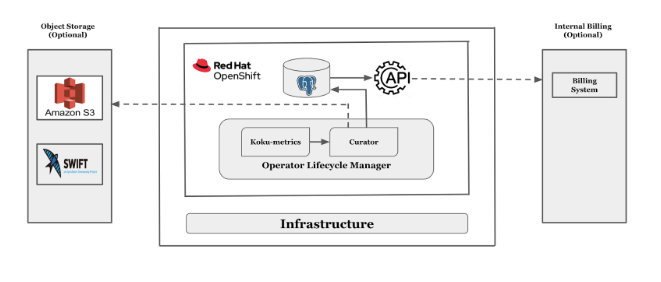

**System Design**
=================

System Architecture
-------------------

Dependencies
------------

The install and deploy Operator Curator, the following prerequisites need to be met:
 * Admin access to OpenShift 4.5+ 
 * Install Koku Metrics Operator 
  * You need to install koku-metrics-operator either via operator-hub or command line. 
  * We are currently using koku-metrics-operator version 0.9.8 with koku-metric config specified here.
 * Install PostgreSQL Image 
  * Need to have a Postgres database up and running in a cluster to store all information. 
  * We are currently using postgres version 10.X.

